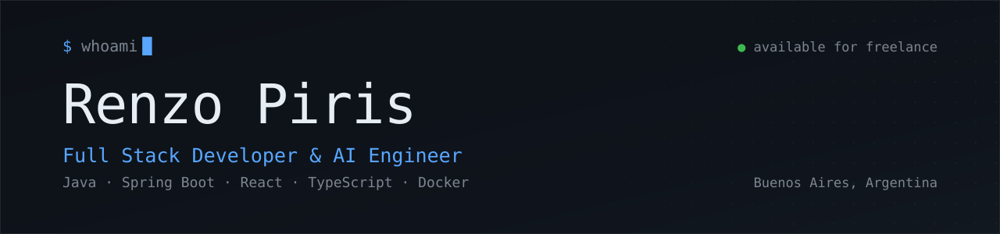

<h1 align="center">Hi there, I'm Renzo 👋</h1>

  <b>Full Stack Developer & AI Engineer</b> from <b>Buenos Aires, Argentina</b> 🇦🇷 
  I build backend services, the frontends that consume them, and the AI tooling around both.

  
  
  

---

## 🚀 What I do

I take services from an empty repository to running inside enterprise systems under strict correctness and traceability requirements. Today that means the banking sector, inside a 7-person engineering team, on systems in production.

- ☕ **Backend:** microservices in Java and Spring Boot — domain model, REST API, migrations, containers and tests. Node with Express when the project calls for it.
- 🔐 **Auth & security:** token-based authentication, role-based access control, CORS, and the parts of the OWASP Top 10 that actually break APIs.
- 💾 **Data:** relational or NoSQL depending on the problem, not on habit. Dynamic filtering that composes instead of multiplying endpoints, caching where it helps, and N+1 caught before production.
- 🎨 **Frontend:** React and TypeScript on those same features — forms, modals, data tables — so the work ships end to end instead of stopping at the API.
- 🤖 **AI:** engineering, not research. Agents, RAG, MCP servers and automation pipelines. I use these daily and know where they break.
- 🧪 **Tests:** unit, integration and property-based. Documentation kept current, and Git done properly: feature branches, commits that explain themselves, review before anything merges.

What I care about in the code I write: **errors that name the problem**, data access that doesn't fall apart under a filter combination nobody predicted, and a README that lets you clone and run without asking anyone. I don't add a dependency when the existing stack already solves the problem.

**Open to freelance and contract work.**

---

## 🛠️ Tech Stack

**Backend**

**Data**

**Frontend**

**Testing & quality**

**Infra & tooling**

**Applied AI**

---

## 🗂️ Selected work

<table>
  <tr>
    <td width="50%" valign="top">
      <h3>🎙️ <a href="https://github.com/RenzoPS/saga">saga</a></h3>
      
Voice assistant for Linux: <b>speech → Claude Code → speech</b>. LiveKit owns the audio runtime, Deepgram does STT/TTS, and a custom LLM plugin delegates to a hot Claude daemon — so it <i>runs</i> things on the machine instead of only answering. ~2-3s end to end.

      

    </td>
    <td width="50%" valign="top">
      <h3>🏢 <a href="https://github.com/RenzoPS/empresa-simulator">empresa-simulator</a></h3>
      
REST API on <b>Spring Boot 4</b>. Dynamic filtering with JPA Specifications, Redis cache-aside, a multi-stage Docker image running as non-root, and CI/CD on GitHub Actions. <b>91 tests.</b>

      

    </td>
  </tr>
  <tr>
    <td width="50%" valign="top">
      <h3>🍸 <a href="https://github.com/RenzoPS/mixopedia">mixopedia</a></h3>
      
Cocktail encyclopedia. React 19 + TypeScript, TheCocktailDB for recipes, and AI generation streamed through the Vercel AI SDK.

      
<b>Live:</b> <a href="https://renzo-mixopedia.netlify.app/">renzo-mixopedia.netlify.app</a>

      

    </td>
    <td width="50%" valign="top">
      <h3>⚽ <a href="https://github.com/RenzoPS/picado">picado</a></h3>
      
Landing page with <b>its own design system</b>, built from a fictional brief. No UI kit, no icon library: every icon and motion behaviour is authored for the page.

      
<b>Live:</b> <a href="https://renzo-picado.netlify.app">renzo-picado.netlify.app</a>

      

    </td>
  </tr>
  <tr>
    <td width="50%" valign="top">
      <h3>✅ <a href="https://github.com/RenzoPS/uptask">uptask</a></h3>
      
Project and task manager. Access token in memory, refresh token in an <code>HttpOnly</code> cookie, and an axios interceptor that renews and <b>replays the original request</b>.

      

    </td>
    <td width="50%" valign="top">
      <h3>🎬 <a href="https://github.com/RenzoPS/cineclub-backend">cineclub-backend</a></h3>
      
Cinema booking API. Seat holds expire on their own via a scheduler, so an abandoned checkout releases the seat instead of blocking it forever.

      

    </td>
  </tr>
  <tr>
    <td width="50%" valign="top">
      <h3>📋 <a href="https://github.com/RenzoPS/wedo-taskys">wedo-taskys</a></h3>
      
A Trello for groups — shared boards, lists, tasks and invitations. Built as a team, <b>17 merged pull requests</b>.

      
<b>Live:</b> <a href="https://wedo-taskys.vercel.app">wedo-taskys.vercel.app</a>

      

    </td>
    <td width="50%" valign="top">
      <h3>📚 <a href="https://github.com/RenzoPS?tab=repositories">And more</a></h3>
      
Every repo has a README with the full picture: how it works, the stack, and how to run it. Have a look 👇

      

    </td>
  </tr>
</table>

---

## 📊 GitHub

  
  

---

## 📬 Get in touch

- 💼 [LinkedIn](https://linkedin.com/in/renzo-piris-saporito)
- ✉️ [renzopiris2006@gmail.com](mailto:renzopiris2006@gmail.com)
- 🐙 [@RenzoPS](https://github.com/RenzoPS)
